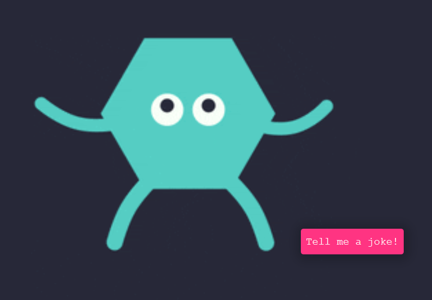

# Joke-Teller
This shape-shifting cartoon enjoys telling jokes about programming. All you need to do is ask it to tell a joke! Built with HTML5, CSS3 and Javascript
This Joke Teller project that uses a Joke API to fetch a programming joke then it uses a Text To Speech API to read out the fetched jokes to user.
 
## Hear the jokes yourselves?
[Tell Me A Joke](https://cerenpaja.github.io/Joke-Teller)

## Screenshot

## GIF Source
Gif is from Giphy.com by artist [sambmotion] (https://giphy.com/gifs/funny-fun-cartoon-2UEMOVIDd0CPBveU3w)
